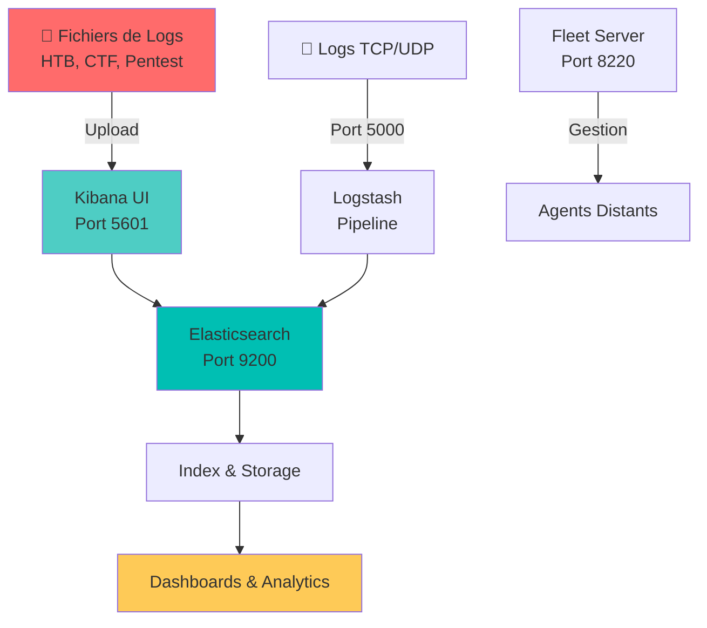

# 🔍 Elastic Stack CDSA - Platform d'Analyse de Logs

<div align="center">


**Plateforme complète d'ingestion, analyse et visualisation de logs pour la cybersécurité**

[📖 Documentation](#-documentation) • [🚀 Installation](#-installation-rapide) • [💡 Utilisation](#-utilisation) • [🎯 Cas d'usage](#-cas-dusage-cdsa)

</div>

---

## 👨‍💻 À propos

**Auteur:** CyberLama  
**Profil:** Étudiant en Cybersécurité  
**Contexte:** Préparation à la certification **CDSA (Certified DevSecOps Associate)**

### 🎓 Objectif du projet

Dans le cadre de mes études en cybersécurité, j'ai développé cette stack Elastic dockerisée pour analyser des logs provenant de diverses sources (CTF, HackTheBox, pentest, forensics). 

Cette plateforme me permet de :
- 📥 **Importer** rapidement des fichiers de logs via glisser-déposer
- 🔎 **Analyser** des patterns suspects dans des volumes importants de données
- 📊 **Visualiser** des corrélations et créer des dashboards interactifs
- 🎯 **S'entraîner** sur des scénarios réels de détection d'intrusions

---

## 🏗️ Architecture de la stack



### 🧩 Composants

| Service | Rôle | Port | Description détaillée |
|---------|------|------|----------------------|
| **Elasticsearch** | Moteur de recherche & BDD NoSQL | 9200 | Indexation et stockage distribué des logs. Recherche full-text ultra-rapide. |
| **Kibana** | Interface de visualisation | 5601 | Dashboard interactif, upload de fichiers, création de visualisations. |
| **Logstash** | Pipeline de traitement | 5000, 5044, 9600 | Parsing, enrichissement et transformation des logs en temps réel. |
| **Fleet Server** | Gestion centralisée | 8220 | Orchestration et configuration des agents Elastic distants. |

---

## 🔐 Sécurité & Authentification

### ⚠️ Credentials par défaut

```
Username: elastic
Password: admin
```

> **🚨 AVERTISSEMENT SÉCURITÉ**  
> Ces credentials sont **volontairement faibles** pour faciliter les tests en environnement local.  
> **NE JAMAIS** utiliser ces credentials en production ou exposer la stack sur Internet.

### ✅ Changer les credentials (OBLIGATOIRE en production)

```bash
# 1. Éditer le fichier de configuration
nano .env

# 2. Modifier ces lignes
ELASTIC_PASSWORD=VotreMotDePasseSuperSecurise123!
KIBANA_PASSWORD=VotreMotDePasseSuperSecurise123!

# 3. Recréer la stack avec les nouveaux credentials
./scripts/reset.sh
./scripts/start.sh
```

**Recommandations :**
- ✅ Minimum 16 caractères (majuscules, minuscules, chiffres, symboles)
- ✅ Activer SSL/TLS pour les communications
- ✅ Mettre en place un firewall restrictif
- ✅ Utiliser des certificats signés en production

---

## 📋 Prérequis

- **Docker** 20.10+ ([Installation](https://docs.docker.com/engine/install/))
- **Docker Compose** V2+ (inclus avec Docker Desktop)
- **Système d'exploitation** : Linux, macOS, ou Windows avec WSL2
- **RAM** : 4GB minimum, **8GB recommandé**
- **Ports libres** : 5601, 9200, 5000, 8220

---

## 🚀 Installation rapide

### 1️⃣ Cloner le repository

```bash
git clone https://github.com/FoottyS11/elastic-cdsa-stack.git
cd elastic-cdsa-stack
```

### 2️⃣ Configurer le système (Linux/WSL uniquement)

```bash
# Augmenter la limite memory map (requis pour Elasticsearch)
sudo sysctl -w vm.max_map_count=262144

# Pour rendre permanent (optionnel)
echo "vm.max_map_count=262144" | sudo tee -a /etc/sysctl.conf
```

### 3️⃣ Lancer la stack

```bash
./scripts/start.sh
```

**Temps de démarrage :** ~2 minutes

### 4️⃣ Accéder à Kibana

Ouvrir dans le navigateur : **http://localhost:5601**

```
👤 Username: elastic
🔑 Password: admin
```

---

## 💡 Utilisation

### 📤 Importer vos fichiers de logs

#### Méthode 1 : Upload via Kibana (Recommandé)

1. Ouvrir **Kibana** : http://localhost:5601
2. Menu (☰) → **Machine Learning** → **Data Visualizer**
3. Cliquer sur **"Upload file"**
4. **Glisser-déposer** votre fichier :
   - Formats supportés : `.log`, `.txt`, `.csv`, `.json`, `.xml`
   - Taille max : 100MB par fichier
5. Kibana détecte automatiquement :
   - Le format et la structure
   - Les timestamps
   - Les types de champs
6. Cliquer sur **"Import"** → Vos logs sont indexés !

#### Méthode 2 : Envoi via Logstash TCP/UDP

```bash
# Envoyer un log via TCP
echo '{"timestamp": "2025-12-23T10:00:00", "level": "ERROR", "message": "Failed login"}' | nc localhost 5000

# Envoyer via UDP
echo "Simple log message" | nc -u localhost 5000
```

#### Méthode 3 : API REST Elasticsearch

```bash
curl -X POST "localhost:9200/mes-logs/_doc" \
  -H 'Content-Type: application/json' \
  -u elastic:admin \
  -d '{
    "timestamp": "'$(date -u +%Y-%m-%dT%H:%M:%S.%3NZ)'",
    "message": "Tentative de connexion SSH depuis IP suspecte",
    "level": "warning",
    "source_ip": "192.168.1.100",
    "service": "ssh"
  }'
```

### 📊 Créer des visualisations

1. **Kibana** → **Analytics** → **Dashboard**
2. Cliquer sur **"Create dashboard"**
3. Ajouter des visualisations :
   - **Line chart** : Évolution temporelle
   - **Pie chart** : Répartition par catégorie
   - **Data table** : Tableaux de logs
   - **Heat map** : Corrélations
   - **Geo map** : Localisation géographique des IPs
4. Filtrer avec **KQL** (Kibana Query Language)

### 🔍 Exemples de requêtes KQL

```
# Rechercher des erreurs
level: "error" OR level: "critical"

# Logs SSH des 24 dernières heures
service: "ssh" AND @timestamp > now-24h

# Échecs d'authentification
message: *"failed"* OR message: *"denied"*

# Requêtes depuis une IP spécifique
source.ip: "192.168.1.100"

# Combinaison complexe
(level: "error" OR level: "warning") AND service: "apache" AND @timestamp > now-1h
```

---

## 🛠️ Gestion de la stack

### ▶️ Démarrer la stack

```bash
./scripts/start.sh
```

**Ce script effectue :**
1. ✅ Configuration système (`vm.max_map_count`)
2. ✅ Démarrage de tous les conteneurs Docker
3. ✅ Vérification de l'état de santé des services
4. ✅ Affichage des URLs d'accès

### ⏸️ Arrêter la stack

```bash
./scripts/stop.sh
```

**Ce script :**
- 🛑 Arrête tous les conteneurs proprement
- 💾 **Conserve toutes vos données** (volumes Docker persistants)
- ⚡ Les logs et indices restent intacts

**Quand utiliser `stop.sh` ?**
- Libérer des ressources système temporairement
- Redémarrer votre machine
- Fin de session de travail

**Important :** Relancer avec `./scripts/start.sh` restaure tout votre environnement.

### 🔄 Réinitialiser complètement

```bash
./scripts/reset.sh
```

**⚠️ ATTENTION : Ce script :**
- 🗑️ **SUPPRIME DÉFINITIVEMENT** tous les conteneurs
- 🗑️ **EFFACE TOUS LES VOLUMES** (logs, indices, configurations)
- 🗑️ Supprime le réseau Docker
- 🧹 Nettoie complètement l'environnement

**Quand utiliser `reset.sh` ?**
- ✅ Repartir de zéro avec une stack propre
- ✅ Changer les credentials (modifications dans `.env`)
- ✅ Corriger une configuration cassée
- ✅ Libérer de l'espace disque

**Après un reset :**
```bash
./scripts/start.sh  # Recréer la stack from scratch
```

### 📊 Vérifier l'état des services

```bash
docker compose ps
```

### 📜 Consulter les logs

```bash
# Tous les services
docker compose logs -f

# Service spécifique
docker compose logs -f elasticsearch
docker compose logs -f kibana
```

---

## 🎯 Cas d'usage CDSA

### 🎓 Scénarios d'apprentissage

#### 1. **Analyse de logs HTB/CTF**
- Import de logs d'attaques web (SQLi, XSS, LFI)
- Identification de payloads malveillants
- Timeline de l'intrusion

#### 2. **Forensics & Incident Response**
- Centralisation de logs multi-sources
- Corrélation d'événements suspects
- Recherche de IoC (Indicators of Compromise)

#### 3. **Détection d'intrusions**
- Pattern matching sur tentatives de brute-force
- Détection d'anomalies (connexions inhabituelles)
- Alertes sur événements critiques

#### 4. **Monitoring applicatif**
- Logs d'applications web (Apache, Nginx)
- Traçabilité des erreurs 500/404
- Performance monitoring

#### 5. **Pentest reporting**
- Agrégation des résultats de scans (Nmap, Nessus)
- Visualisation des vulnérabilités
- Génération de rapports

---

## 📁 Structure du projet

```
elastic-cdsa-stack/
├── 📄 docker-compose.yml        # Orchestration des 4 services
├── 📄 .env                      # Configuration (passwords, ports, resources)
├── 📄 README.md                 # Cette documentation
│
├── 📂 config/
│   ├── 📂 logstash/
│   │   ├── logstash.yml         # Config Logstash
│   │   └── pipeline/
│   │       └── logstash.conf    # Pipeline de parsing
│   │
│   └── 📂 
│
└── 📂 scripts/
    ├── 🚀 start.sh              # Démarrage de la stack
    ├── ⏸️  stop.sh               # Arrêt (conserve les données)
    └── 🔄 reset.sh              # Réinitialisation complète
```

---

## 🔧 Configuration avancée

### Ajuster les ressources mémoire

Éditer `.env` :

```bash
# Pour machines avec 8GB+ RAM
ES_JAVA_OPTS=-Xms2g -Xmx2g
LS_JAVA_OPTS=-Xms1g -Xmx1g

# Pour machines avec 4GB RAM (minimal)
ES_JAVA_OPTS=-Xms1g -Xmx1g
LS_JAVA_OPTS=-Xms512m -Xmx512m
```

### Personnaliser les ports

```bash
# Dans .env
ES_PORT=9200
KIBANA_PORT=5601
LOGSTASH_TCP_PORT=5000
FLEET_PORT=8220
```

---

## 🐛 Dépannage

### Elasticsearch ne démarre pas

**Erreur :** `max virtual memory areas vm.max_map_count [65530] is too low`

**Solution :**
```bash
sudo sysctl -w vm.max_map_count=262144
```

### Kibana affiche "Kibana server is not ready yet"

**Causes possibles :**
- Elasticsearch encore en cours de démarrage (attendre 2-3 min)
- Problème de connexion réseau interne Docker

**Solutions :**
```bash
# Vérifier qu'Elasticsearch répond
curl -u elastic:admin http://localhost:9200

# Redémarrer Kibana si nécessaire
docker compose restart kibana
```

### Pas assez de mémoire

**Symptômes :** Conteneurs qui crashent, lenteurs

**Solutions :**
1. Réduire `ES_JAVA_OPTS` dans `.env`
2. Augmenter la RAM allouée à Docker Desktop
3. Fermer d'autres applications

### Reset en cas de problème

```bash
./scripts/reset.sh
./scripts/start.sh
```

---

## 📚 Ressources & Documentation

### Documentation officielle Elastic

- 📖 [Elasticsearch Reference](https://www.elastic.co/guide/en/elasticsearch/reference/current/index.html)
- 📖 [Kibana Guide](https://www.elastic.co/guide/en/kibana/current/index.html)
- 📖 [Logstash Documentation](https://www.elastic.co/guide/en/logstash/current/index.html)
- 📖 [Upload Files to Kibana](https://www.elastic.co/guide/en/kibana/current/connect-to-elasticsearch.html#upload-data-kibana)

### Tutoriels & Apprentissage

- 🎓 [Kibana Query Language (KQL)](https://www.elastic.co/guide/en/kibana/current/kuery-query.html)
- 🎓 [Creating Visualizations](https://www.elastic.co/guide/en/kibana/current/create-a-dashboard-of-panels-with-web-server-data.html)
- 🎓 [Elastic SIEM](https://www.elastic.co/guide/en/security/current/index.html)

### Certifications

- 🎯 [CDSA - Certified DevSecOps Associate](https://www.practical-devsecops.com/certified-devsecops-associate/)
- 🎯 [Elastic Certified Engineer](https://www.elastic.co/training/certification)

---

## 🤝 Contribution

Les contributions sont les bienvenues ! 

**Pour contribuer :**
1. Fork ce repository
2. Créer une branche (`git checkout -b feature/amelioration`)
3. Commit vos changements (`git commit -m 'Ajout de fonctionnalité'`)
4. Push vers la branche (`git push origin feature/amelioration`)
5. Ouvrir une Pull Request

**Idées de contributions :**
- 📝 Ajout de pipelines Logstash pré-configurés
- 📊 Templates de dashboards pour différents cas d'usage
- 🐛 Corrections de bugs
- 📖 Amélioration de la documentation

---

## �� Licence

**MIT License** - Libre d'utilisation pour l'apprentissage et la formation.

```
Copyright (c) 2025 CyberLama

Permission is hereby granted, free of charge, to any person obtaining a copy
of this software and associated documentation files (the "Software"), to deal
in the Software without restriction.
```

---

## ⚡ Statut de la stack

| Service | Statut | Description |
|---------|--------|-------------|
| Elasticsearch | ✅ Operational | Indexation & recherche full-text |
| Kibana | ✅ Accessible | Interface web avec upload de fichiers |
| Logstash | ✅ Pipeline actif | Parsing TCP/UDP/Beats |
| Fleet Server | ✅ Opérationnel | Gestion centralisée agents |

---

## 📬 Contact

**CyberLama**  
🎓 Étudiant en Cybersécurité  
🎯 CDSA in progress

📧 Questions ? Ouvrez une [issue](https://github.com/FoottyS11/elastic-cdsa-stack/issues)

---

<div align="center">

**⭐ Si ce projet vous a aidé, n'hésitez pas à lui donner une étoile ! ⭐**

Made with ❤️ by CyberLama pour la communauté cybersécurité

</div>
